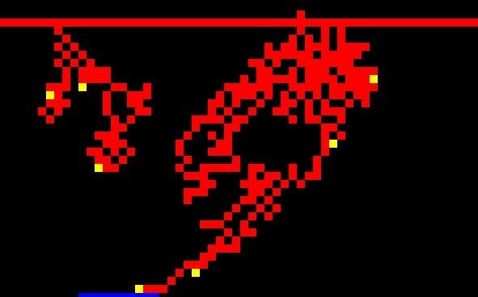

# Cellular Automata Model of Angiogenesis
### Simulating the emergence of new blood vessels using discrete cellular automata and with accordance to the classical model of angiogenesis.

By Matan Hoory and Maya Raysin



## Table of Contents

- [Introduction](#introduction)
- [Installation](#installation)
- [Usage](#usage)


## Introduction

To simulate angiogenesis, we implemented a cellular automaton based on two driving forces:
The chemical gradient created by the concentrations of the growth factor (VEGF), and the
mechanical pressure exerted by cells. We used a finite lattice, which hosted three different
types of cells, each following a different set of probabilistic rules which were applied synchronously:
* Attractor Cells (blue): These cells represent locations that require blood such as new or injured
tissue, or cancer cells. They increase the concentration of VEGF in their surroundings in
relation to the distance. Meaning that as you get closer to the attractor, the concentration
rises.
* Stalk Cells (red): Proliferative cells that act as the main building block of the blood vessel. By
proliferation, they are able to create Tip Cells during a process called sprouting.
* Tip Cells (yellow): Migratory cells that migrate along the gradient of VEGF. In the biological system, the
tip cells are physically attached to the stalk cells. In our model, we use a simplification in
which the movement of tip cells creates a trail of stalk cells.

## Installation

Dependencies (available in requirements.txt): 
```
matplotlib>=3.7.1
numpy>=1.24.2
pandas>=1.5.3
```
Written in python 3.8.10

## Usage

See project report for more information on usage and methods.  
A web app for more convenient usage is under development. 

- main.py - Used for running the engine. Examples included inside.
- config.json - Used for input of different parameters for the model (e.g p_migrate for defining the probability of a tip cell to move).  
- initial_states.py - Imported to main.py and used for configuration of initial stated for the grid. Sample initial grids are available. 

